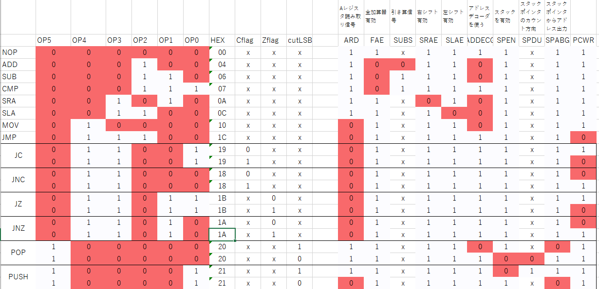
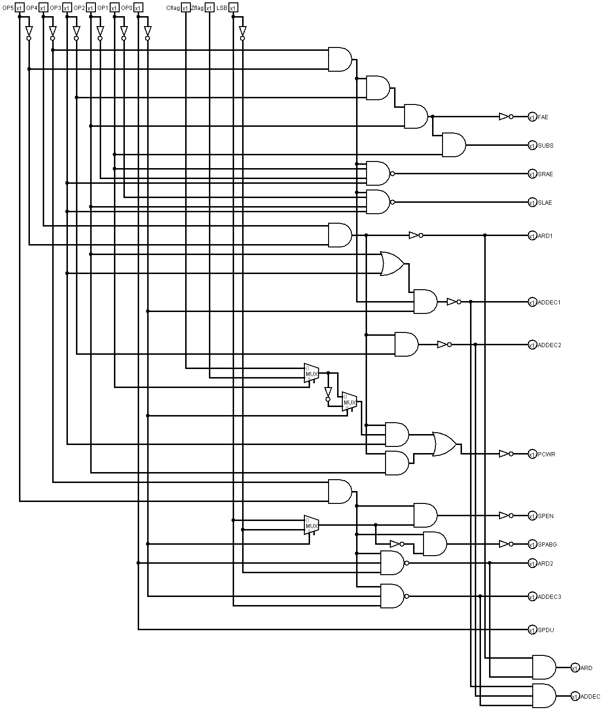

# verilogでシミュレーションする
前作のTTM4は命令デコーダの部分だけシミュレートしましたが、それ以外は特に使わず、まず紙に書いてそれからブレットボードで不安なところ実験して、そして回路図書いて基板図かいて基板届いてデバックしてってな感じで開発しました。TTM8(仮)では、まず1クロック1命令というのを止めようと思います。1クロック1命令すなわち1CPIですが、CPUの動作を理解する上でとっても良かったと思います。
<a href="https://www.amazon.co.jp/CPU%E3%81%AE%E5%89%B5%E3%82%8A%E3%81%8B%E3%81%9F-%E6%B8%A1%E6%B3%A2-%E9%83%81-ebook/dp/B08639XM13/ref=sr_1_2?__mk_ja_JP=%E3%82%AB%E3%82%BF%E3%82%AB%E3%83%8A&dchild=1&keywords=CPU%E3%81%AE%E4%BD%9C%E3%82%8A%E6%96%B9&qid=1591975083&sr=8-2" target="_blank">「CPUの創り方」</a>
を読んでとってもいいな。と思って構成を参考にさせて頂きました。ですがこれを実現するために特にスタック周りを無理に構成したのでかえって分かりずらくしてしまったのでした。でもスタックはほしいですよね。コンパクトにしなきゃいけない分レジスタはあまり載せられませんから、それを補うという目的でもほしいです。なので6CPIになりました。(今のところ)命令によってクロック数は変えない予定です。<br>
そう設計すると命令デコーダまわりがちょっと複雑になっちゃうので(命令デコーダは内部が複雑でもひと塊で考えて問題ないのでヨシとします。)、最初紙で書いてたんですけど自分でも把握できなくなってきたのでverilog HDL で書いてシミュレーションしてみることにしました。今一生懸命書いているところです。たぶんシミュレーション上で完成させるだけでえらい時間かかるかな。<br>
現在のところALUはこんな感じ
```
module ALU(
        input wire [7:0] in0,
        input wire [7:0] in1,
        input wire FAE,
        input wire SUBS,
        input wire SRAE,
        input wire SLAE,
        output wire [7:0] out,
        input wire CLK,
        input wire RST,
        input wire FROE,
        output reg Cflag,
        output reg Zflag
);

        //ADD,SUBのための組み合わせ回路
        wire [7:0]XORout;
        wire [7:0]FAout;
        wire carry;
        wire zero;
        assign XORout = in1 ^ {SUBS, SUBS, SUBS, SUBS, SUBS, SUBS, SUBS, SUBS};
        assign {carry, FAout} = in0 + XORout + SUBS;
        assign zero = (FAout == 8'h00)? 1'b1 : 1'b0;

        assign out = ~FAE ? FAout : 8'bz;
        assign out = ~SRAE ? (in0 >> 1) : 8'bz;
        assign out = ~SLAE ? (in0 << 1) : 8'bz;
        assign out = ~FROE ? {6'b0, Zflag, Cflag} : 8'bz;

        always @(posedge CLK) begin
                if(~FAE) begin
                        Cflag <= carry;
                        Zflag <= zero;
                end else begin
                        Cflag <= Cflag;
                        Zflag <= Zflag;
                end
        end
        always @(negedge RST) begin
                Cflag <= 0;
                Zflag <= 0;
        end
endmodule
```

# 命令デコーダ
肝心の命令デコーダですが、verilogはまだ慣れてないので、いきなりverilogで設計するのは無理でした。まず真理値表書いてからlogisimというソフトで論理回路組んでみました。一応形にはなりましたがまだ最適化(実際のロジックICの使用数をなるだけ少なくしたい)はしてないです。マシン語ってどうやって決めればいいのでしょう?今回は命令デコーダがなるだけ簡単になるようにマシン語決めましたが、上から0001,0010,0011とかの方が分かりやすいんですかね?そうすると命令デコーダえらい大変になりそう。verilogではまだ書いてないです。

<br>


