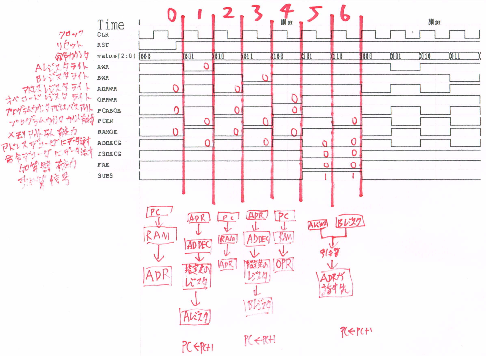

# ブロック図
CPU全体のブロック図です。データバスを介して各ユニットが接続されています。まず左側から、AレジスタとBレジスタがALUに繋がっており、ALUはA,Bレジスタの値を演算します。ALUには演算結果によってセットされるフラグを保持するフラグレジスタがついてます。演算結果とフラグレジスタをデータバスに出力できます。Cレジスタ、Dレジスタは汎用のレジスタです。特別な機能を持たず値を保持することのみ可能です。A,Bレジスタは後に解説しますが、命令実行サイクル中に自動的に書き換わってしまうため、保持し続ける必用があるデータはこのC、Dレジスタに保存しましょう。プログラムカウンタ、スタックポインタはアドレスを格納します。データバスの他にアドレスバスとも接続されます。CPU制御部としてひとくくりできます。CPU制御部は内部にカウンタ、デコーダを持っており命令実行を制御します。

# 命令実行サイクル
命令実行は7クロックで1サイクルです。
1. ロード先アドレスをアドレスレジスタに保存
1. アドレスレジスタが示す先からAレジスタに転送
1. ストア先アソレスをアドレスレジスタに保存
1. アドレスレジスタが示す先からBレジスタに転送
1. オペコードをオペコードレジスタに保存
1. 命令を実行
1. 命令を実行

 
シミュレーション上での制御信号波形を示します。
 
上からクロック、リセット、制御カウンタでそこから下は制御信号です。それぞれ左に意味を書きました。
1サイクルは0から6のカウンタで制御されます。制御信号は0で有効です。 

1. ロード先アドレスをアドレスレジスタに保存
    - ADRWR,PCABOE,RAMOEが有効。
    1. PCABOEが有効でプログラムカウンタからアドレスバスに出力する。
    1. RAMOEが有効でRAMはプログラムカウンタから指定されたアドレスの値をデータバスに出力する。
    1. ADRWRが有効でアドレスレジスタはデータバスに流れてるデータを保持する。
1. アドレスレジスタが示す先からAレジスタに転送
    - AWR,PCEN,ADDECGが有効。
    1. ADDECGが有効でアドレスレジスタからアドレスデコーダに転送され指定のアドレスにリード信号を送る。
    1. リード信号を受けた先がデータをデータバスに流す。
    1. AWRが有効でAレジスタはデータバスに流れているデータを保持する。
    1. PCENが有効でプログラムカウンタがインクリメント。
1. ストア先アソレスをアドレスレジスタに保存
    - ADRWR,PCABOE,RAMOEが有効。
    1. PCABOEが有効でプログラムカウンタからアドレスバスに出力する。
    1. RAMOEが有効でRAMはプログラムカウンタから指定されたアドレスの値をデータバスに出力する。
    1. ADRWRが有効でアドレスレジスタはデータバスに流れてるデータを保持する。
1. アドレスレジスタが示す先からBレジスタに転送
    - BWR,PCEN,ADDECGが有効。
    1. ADDECGが有効でアドレスレジスタからアドレスデコーダに転送され指定のアドレスにリード信号を送る。
    1. リード信号を受けた先がデータをデータバスに流す。
    1. BWRが有効でBレジスタはデータバスに流れているデータを保持する。
    1. PCENが有効でプログラムカウンタがインクリメント。
1. オペコードをオペコードレジスタに保存
    - OPRWR,PCABOE,RAMOEが有効。
    1. PCABOEが有効でプログラムカウンタからアドレスバスに出力する。
    1. RAMOEが有効でRAMはプログラムカウンタから指定されたアドレスの値をデータバスに出力する。
    1. OPRWRが有効でオペコードレジスタはデータバスに流れてるデータを保持する。
1. 命令を実行(今回は減算命令を実行)
    - ISDECGが有効。
    1. ISDECGが有効でオペコードレジスタから命令デコーダに転送され減算命令に必要なADDECG,FAE,SUBSを有効。
    1. ADDECGが有効でアドレスレジスタからアドレスデコーダに転送され指定のアドレスにライト信号を送る。(このアドレスはカウンタが2の時に書き込んだもの)
    1. FAE,SUBS(1で有効)が有効でALUはAレジスタ、Bレジスタの値を演算(今回は減算)し演算結果をデータバスに流す。
1. 命令を実行(今回は減算命令を実行)
    - ※スタック操作では二回クロックが必要だが今回は一回でよいためカウンタ5と同様の信号を出力する。加えてPCENが有効。
    1. PCENが有効でプログラムカウンタがインクリメント。

