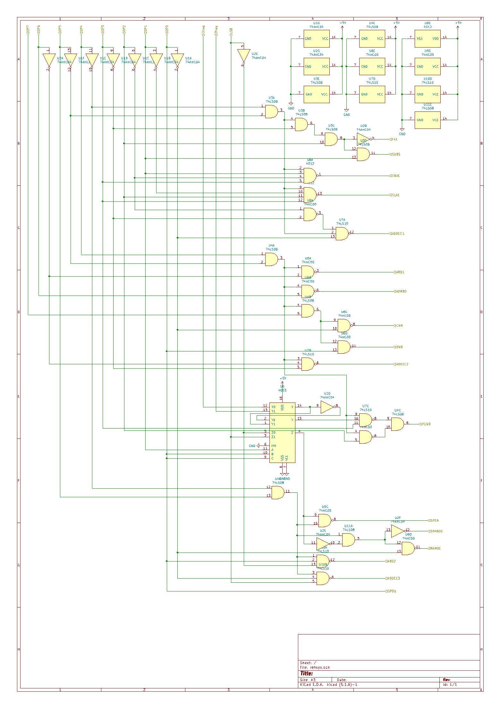

# 進歩
シミュレーション上でCPU完成しました！一通りの動作を確認してデバックいたしました。ソフト的には問題ないと思われます。次はこれをハードウェアに起していきます。私は今まで回路CADとしてEAGLEを使用してきたのですが、今回はKiCADに挑戦してみようと思います。良さそうなら乗り換えるつもりです。
# 命令デコーダ回路図
CPUの中で一番ややこしくなった命令デコーダから回路図に起してみました。ここだけでロジックICの数は11個にもなってしまいます。なるだけ小さくしたいですがどうなるかは進めてみないとなんとも言えません。片手で持てるようにはするつもりです。

